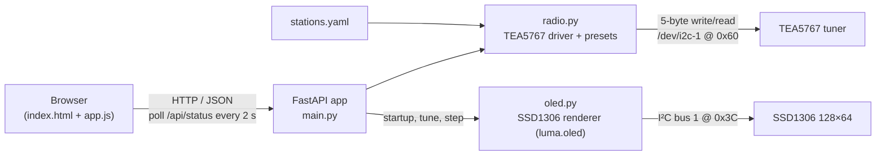

# pi-fm-radio

A Raspberry Pi Zero based FM radio receiver. A **TEA5767** FM tuner module and an optional
**SSD1306 128×64 OLED** share the Pi's I²C bus. A small **FastAPI** server offers a
retro-styled web UI and a JSON API for tuning, stepping, muting, forcing mono, and reading the
signal level. Station presets come from a simple `stations.yaml` file.

It suits a headless Pi Zero on the home network: you tune the radio from a phone or browser,
and the OLED shows the current station.

## Table of contents

- [Features](#features)
- [Screenshots](#screenshots)
- [Hardware](#hardware)
- [How it works](#how-it-works)
- [Requirements](#requirements)
- [Installation](#installation)
- [Configuration](#configuration)
- [Usage](#usage)
- [API reference](#api-reference)
- [Troubleshooting](#troubleshooting)
- [Known issues and limitations](#known-issues-and-limitations)
- [Development](#development)
- [Contributing](#contributing)
- [License](#license)

## Features

- **TEA5767 FM tuner control** over I²C (`/dev/i2c-1`, address `0x60`), using raw
  `ioctl`/`read`/`write` calls. No extra I²C Python library is needed for the tuner.
- **Band 87.5–108.0 MHz**, tuned in **0.1 MHz** steps. Frequencies outside the band are clamped.
- **Direct tuning** to any frequency, plus **step up/down** by 0.1 MHz.
- **Presets** loaded from `stations.yaml`, shown as buttons in the web UI and reloadable at runtime
  without a restart.
- **Station name lookup**: a frequency within ±0.05 MHz of a preset shows that preset's name;
  otherwise the name is `Unknown`.
- **Mute / unmute** and **mono / stereo** buttons.
- **Status readout**: frequency, stereo indicator, and signal level (the TEA5767 4-bit ADC level,
  `0`–`15`), plus the raw 5-byte register dump.
- **Optional SSD1306 OLED** (128×64, I²C `0x3C`) showing the station name, frequency,
  Stereo/Mono, and a signal bar. It is redrawn only at startup and after a tune or step, not on a
  timer (the code comments note that frequent TEA5767 reads can cause audible ticks). If the OLED
  libraries or the display are missing, the server keeps running without it.
- **Retro web UI** ("Pi-FM Console") with an analog dial and needle, a frequency window, Stereo and
  Mute lamps, a 15-bar signal meter, and preset buttons. It polls `/api/status` every 2 seconds.

Not implemented: volume control (the TEA5767 has no volume register), automatic seek/scan,
RDS, physical buttons or a rotary encoder, and saving the last station to disk.

## Screenshots

<!-- TODO: screenshot -->

## Hardware

### Bill of materials

| Part | Notes |
|------|-------|
| Raspberry Pi Zero (W / 2 W) | Any Pi with the 40-pin header and I²C bus 1 should work. <!-- TODO: verify which Pi Zero model is used --> |
| TEA5767 FM tuner module | I²C address `0x60` (fixed in `radio.py`). The code assumes a 32.768 kHz crystal and high-side injection. |
| SSD1306 128×64 OLED, I²C (optional) | Address `0x3C` by default; `0x3D` is supported by editing `main.py`. |
| Antenna | Suggestion: a wire of about 75 cm (a quarter wavelength at FM) on the module's antenna pad. |
| Audio output | The TEA5767 has a low-level line output; headphones or a small amplifier and speaker are needed. <!-- TODO: verify the audio stage used --> |

### Wiring

Both devices share I²C bus 1. The code uses no other GPIO pins: there are no buttons and no
rotary encoder.

| Signal | Raspberry Pi pin | TEA5767 | SSD1306 OLED |
|--------|------------------|---------|--------------|
| 3.3 V  | Pin 1 (3V3) | VCC <!-- TODO: verify supply voltage of your module --> | VCC |
| GND    | Pin 6 (GND) | GND | GND |
| SDA    | Pin 3 (GPIO 2 / SDA1) | SDA | SDA |
| SCL    | Pin 5 (GPIO 3 / SCL1) | SCL | SCL |

After wiring, `i2cdetect -y 1` should list `60` (TEA5767) and `3c` (OLED).

## How it works



- `radio.py` talks to the TEA5767 by writing its 5 control bytes and reading back its 5 status
  bytes. It converts between MHz and the PLL word
  (`PLL = 4 × (f + 225 kHz) / 32768`) and keeps the current frequency, forced-mono flag, and mute
  flag in memory. The chip cannot report mute, so the server tracks it itself.
- `main.py` is the FastAPI app. It serves the page, the static files, and the JSON API, and
  refreshes the OLED after each station change.
- `oled.py` draws one 1-bit frame with Pillow and pushes it through `luma.oled`. It also has an
  optional background refresh loop (`start()`/`stop()`), but `main.py` does not use it.

### State

All state is **in memory only**. Nothing is written to disk. After a restart the tuner keeps
whatever frequency it was last set to (as long as it stayed powered), but the server does not
know it until you tune. Because of a locking bug, the first step after a restart hangs the server
if nothing was tuned before it (see [Known issues](#known-issues-and-limitations)). The mute flag and the forced-mono flag reset to "unmuted" and
"stereo".

## Requirements

- Raspberry Pi OS (or another Linux) with **I²C enabled**:
  `sudo raspi-config` → *Interface Options* → *I2C* → *Enable*, then reboot.
  This creates `/dev/i2c-1`.
- Python 3 with `pip`. <!-- TODO: verify minimum Python version -->
- The user running the server needs access to `/dev/i2c-1` (for example, membership in the `i2c`
  group).
- Optional: `i2c-tools` for `i2cdetect`.

Python dependencies are listed in [`radio/requirements.py`](radio/requirements.py). Despite the
`.py` extension it is a plain pip requirements list, not Python code:

```text
fastapi
uvicorn
jinja2
luma.oled
pillow
PyYAML
```

`luma.oled` and `pillow` are only needed for the OLED display.

## Installation

```bash
sudo apt update
sudo apt install -y python3-venv python3-pip i2c-tools

git clone https://github.com/t0mer/pi-fm-radio.git
cd pi-fm-radio

python3 -m venv .venv
. .venv/bin/activate
pip install -r radio/requirements.py

# Check that both devices are visible on the bus
i2cdetect -y 1
```

There is no Dockerfile, packaged release, or systemd unit in this repository.
`radio.py` also looks for `/opt/radio/stations.yaml`, which suggests the author deploys the
`radio/` folder to `/opt/radio`. <!-- TODO: verify intended install location / service setup -->

## Configuration

### Station presets: `stations.yaml`

```yaml
stations:
  - name: "Echo 99 FM"
    freq: 99.0
  - name: "Radius 100 FM"
    freq: 100.0
```

- `stations` is a list of entries with `name` (string) and `freq` (MHz, rounded to 0.1).
- Entries with a missing or non-numeric `freq` are skipped. A missing `name` becomes `Station`.
- Presets are sorted by frequency in the UI and the API.
- If no stations file is found, two built-in defaults are used: `96.6` → `Preset 1` and
  `99.8` → `Preset 2`.

The file is looked up in this order (first match wins):

1. The path in the `STATIONS_FILE` environment variable, if that file exists
2. `/opt/radio/stations.yaml`
3. `stations.yaml` next to `radio.py` (`radio/stations.yaml`)

After editing the file, reload it with `POST /api/presets/reload`. The preset buttons on the page
update after a page refresh.

### Environment variables

| Variable | Default | Description |
|----------|---------|-------------|
| `STATIONS_FILE` | *(unset)* | Path to a stations YAML file. Ignored if the file does not exist. |

### Constants in code

There is no config file for the hardware; change these constants in the source if needed.

| File | Constant | Default | Meaning |
|------|----------|---------|---------|
| `radio.py` | `I2C_DEV` | `/dev/i2c-1` | I²C bus device for the tuner |
| `radio.py` | `TEA5767_ADDR` | `0x60` | TEA5767 I²C address |
| `radio.py` | `FREQ_MIN` / `FREQ_MAX` | `87.5` / `108.0` | Tuning range in MHz |
| `radio.py` | `STEP` | `0.1` | Step size in MHz for `/api/step` |
| `radio.py` | `DE_EMPHASIS` | `50` | Must stay `50`; see [Known issues](#known-issues-and-limitations) |
| `main.py` | `OledDisplay(address=0x3C)` | `0x3C` | OLED address (use `0x3D` if your panel uses it) |
| `oled.py` | `OledDisplay(i2c_port, width, height, rotate)` | `1`, `128`, `64`, `0` | OLED bus, size and rotation |

## Usage

The app has no `__main__` block; start it with uvicorn **from inside the `radio/` directory**,
because `main.py` imports the sibling modules `radio` and `oled` directly:

```bash
cd radio
uvicorn main:app --host 0.0.0.0 --port 8000
```

Then open `http://<pi-address>:8000/` in a browser. Port `8000` is uvicorn's default; the code
does not set a port.

### Web UI

- **Dial and frequency window** show the current frequency (the needle maps 87.5–108.0 MHz).
- **Station** shows the matching preset name, or `Unknown`.
- **Stereo** and **Mute** lamps, and a **15-bar signal meter**.
- Buttons: **◀ 0.1** / **0.1 ▶** (step), **Mute**, **Unmute**, **Mono**, **Stereo**.
- **Presets**: one button per entry in `stations.yaml`.

### curl examples

```bash
HOST=http://raspberrypi.local:8000

curl "$HOST/api/status"
curl -X POST "$HOST/api/tune"  -H 'Content-Type: application/json' -d '{"frequency": 99.0}'
curl -X POST "$HOST/api/step"  -H 'Content-Type: application/json' -d '{"direction": "up"}'
curl -X POST "$HOST/api/mute"
curl -X POST "$HOST/api/unmute"
curl -X POST "$HOST/api/mono"  -H 'Content-Type: application/json' -d '{"mono": true}'
curl "$HOST/api/presets"
curl -X POST "$HOST/api/presets/reload"
```

## API reference

There is no authentication. FastAPI's automatic docs are also available at `/docs` and `/redoc`.

| Method | Path | Body | Response |
|--------|------|------|----------|
| `GET` | `/` | – | Web UI (HTML) |
| `GET` | `/static/...` | – | CSS and JavaScript |
| `GET` | `/api/status` | – | `{"frequency", "station_name", "stereo", "signal", "muted", "raw"}` |
| `POST` | `/api/tune` | `{"frequency": <MHz>}` | `{"ok": true, "frequency", "station_name"}` (frequency clamped to the band, rounded to 0.1) |
| `POST` | `/api/step` | `{"direction": "up" \| "down"}` (required; `{}` means `up`) | `{"ok": true, "frequency", "station_name"}`, or `400` for any other direction |
| `POST` | `/api/mute` | – | `{"ok": true}` |
| `POST` | `/api/unmute` | – | `{"ok": true}` |
| `POST` | `/api/mono` | `{"mono": true \| false}` (required; `{}` means `false`) | `{"ok": true, "mono"}` |
| `GET` | `/api/presets` | – | `{"presets": [{"freq", "name"}, ...]}` |
| `POST` | `/api/presets/reload` | – | `{"ok": true, "count", "file"}` |

`/api/tune`, `/api/step` and `/api/mono` require a JSON body; a request with no body returns
`422`. The defaults above apply only when an empty object `{}` is sent. `mono` is converted with
Python's `bool()`, so any non-empty string, including `"false"`, counts as `true`.

Example `/api/status` response (values are illustrative):

```json
{
  "frequency": 98.997,
  "station_name": "Echo 99 FM",
  "stereo": true,
  "signal": 11,
  "muted": false,
  "raw": [175, 80, 180, 176, 0]
}
```

`signal` is the TEA5767 ADC level (`0`–`15`). `raw` holds the 5 status bytes read from the chip.
The `frequency` is decoded from the chip's PLL word, so it may differ slightly from the value you
tuned to. The OLED and web UI round it to 0.1 MHz.

## Troubleshooting

- **`FileNotFoundError: /dev/i2c-1`**: I²C is not enabled. Enable it in `raspi-config` and reboot.
- **`PermissionError` on `/dev/i2c-1`**: run as a user in the `i2c` group
  (`sudo usermod -aG i2c $USER`, then log in again).
- **`OSError: [Errno 121] Remote I/O error`**: nothing answers at `0x60`. Check wiring and power,
  and run `i2cdetect -y 1`.
- **`[oled] optional import failed` or `[oled] init failed`** in the log: `luma.oled`/`pillow` are
  missing, or the display is not at `0x3C`. The radio keeps working without the OLED. If
  `i2cdetect` shows `3d`, change the address in `main.py`.
- **`ModuleNotFoundError` / `ImportError` for `radio` or `oled`**: start uvicorn from inside the
  `radio/` directory (see [Usage](#usage)).
- **Station name shows `Unknown`**: the tuned frequency is not within 0.05 MHz of a preset. Check
  `stations.yaml` and call `POST /api/presets/reload`.
- **Faint ticking in the audio**: the code notes that frequent status reads can cause audible ticks.
  The web UI polls every 2 seconds; close the page to stop polling.
- **HTTP 422 from `/api/tune`, `/api/step` or `/api/mono`**: the request has no JSON body. Send at
  least `{}` (for `/api/tune`, a `frequency` is needed).
- **HTTP 500 from `/api/tune`**: the body has no `frequency`, or its value cannot be converted to a
  number. Numeric strings such as `"99.0"` are accepted.
- **Server hangs after pressing step**: after a restart, the first `/api/step` deadlocks if nothing
  was tuned yet, and every later API call blocks too. Restart the server, then tune a preset once
  (or call `/api/tune`) before using the step buttons.

## Known issues and limitations

These are observations from reading the code. They have not been fixed here.

- **Deadlock on the first step after a restart.** `step()` holds `_state_lock` and, when no
  frequency is known yet, calls `read_status()`, which takes the same non-reentrant
  `threading.Lock`. The first `/api/step` without a prior tune hangs, and every later API call
  that needs the lock blocks too. Workaround: tune a preset once before stepping.
- **"Mono" does not force mono.** The Mono-to-Stereo bit (MS, write byte 3 bit 3) is always `0`.
  `set_mono()` and `set_frequency(stereo=False)` toggle bit 7 of byte 3 instead, which is the
  Search Up/Down (SUD) bit.
- **Mute and mono reset each other.** `mute()`, `unmute()`, `set_mono()` and `set_stereo()` rebuild
  the control bytes from a fixed template, so:
  - muting or unmuting turns forced mono off;
  - Mono/Stereo turns mute off, but the tracked mute flag is not updated.
- **Tuning clears the mute on the chip, but not the mute flag.** `tune_to()` and `step()` always
  write with mute off, so after tuning while muted the audio plays but `/api/status` still reports
  `"muted": true`.
- **`DE_EMPHASIS` actually controls the crystal bit.** Byte 4 is set to `0x10` (the 32.768 kHz XTAL
  bit) only when `DE_EMPHASIS == 50`. Any other value would break the PLL calculation.
  De-emphasis itself is set by write byte 5, which is always `0x00`: its DTC bit is `0`, so
  de-emphasis is always 50 µs.
- No persistence of the last station, mute, or mono state across restarts.
- No volume control, seek, or scan; stepping is fixed at 0.1 MHz.
- No authentication on the API; do not expose the server outside a trusted network.
- The app uses `@app.on_event("startup")`, which is deprecated in recent FastAPI versions.

## Development

### Project layout

```text
pi-fm-radio/
├── README.md
└── radio/
    ├── __init__.py          # empty
    ├── main.py              # FastAPI app: routes, templates, OLED refresh
    ├── radio.py             # TEA5767 I²C driver, tuning, presets loader
    ├── oled.py              # SSD1306 renderer (luma.oled + Pillow)
    ├── requirements.py      # pip requirements list (plain text despite the .py name)
    ├── stations.yaml        # station presets
    ├── templates/
    │   ├── index.html       # web UI
    │   └── index.old        # leftover from an earlier UI
    └── static/
        ├── css/styles.css   # retro console styles (styles.old: leftover)
        └── js/app.js        # API calls, status polling, dial needle (app.old: leftover)
```

The `.old` files belong to an earlier, simpler version of the UI. `templates/index.old` is not
rendered by any route, but `static/css/styles.old` and `static/js/app.old` are still reachable
through the `/static` mount.

### Running locally

Run with auto-reload while developing:

```bash
cd radio
uvicorn main:app --host 0.0.0.0 --port 8000 --reload
```

The server needs real I²C hardware for the tuner. There are no tests, linters, or CI workflows in
the repository.

## Contributing

Issues and pull requests are welcome. Keep changes small and test them on real hardware (a Pi with a
TEA5767 module), since the tuner code talks to the chip directly.

## License

This repository has no `LICENSE` file, so no license has been granted. Contact the author before
reusing the code. <!-- TODO: verify / add a LICENSE file -->
